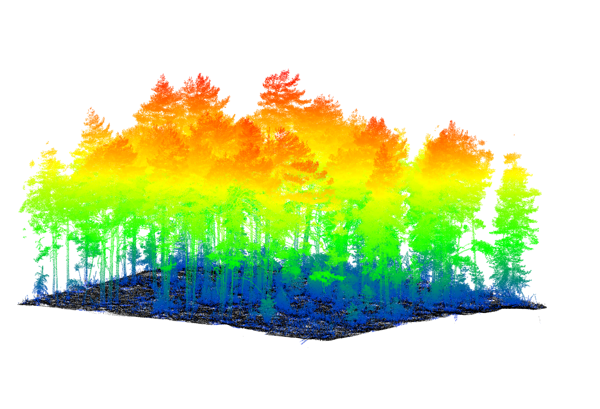

### Credit to @PhilWilkes for the original version of this code.

# LiDAR Point Cloud Processing Tool

A Python tool for processing and analyzing LiDAR point cloud data. Forked from [https://github.com/philwilkes/rxp-pipeline], with additional features for enhanced point cloud processing.




# Compile PDAL with python bindings and rxp support 
Download the rivlib-2_5_10-x86_64-linux-gcc9.zip (make sure to get the gcc9 version) and the the rdblib-2.4.0-x86_64-linux.tar.gz from the memebers area of the RIEGL website.
Place the zipped folder into this directory alongside the install_pdal.sh script. 

```bash
cd rxp-pipeline
bash install_pdal.sh
```

## Added Features

- Ground classification using Cloth Simulation Filter (CSF)
- Precise cropping using scan position convex hull
- Full plot output capabilities
- Point cloud downsampling procedures
- Global matrix transformation to GNSS coordinate system

## Usage

```bash
python3 convert.py --project ~/Desktop/SPA19_2021-09-29.PROJ/ --plot-code SPA19 --deviation 15 --reflectance -20 0  --tile 5 --res 0.01 --buffer 1.0 --plot --classify-ground --verbose
```

See `python convert.py --help` for all available options.

## Requirements

- Python 3.x
- PDAL
- NumPy
- Pandas
- SciPy

## Credits

Based on https://github.com/philwilkes/rxp-pipeline with extensions for ground classification, spatial processing, and coordinate transformation.

